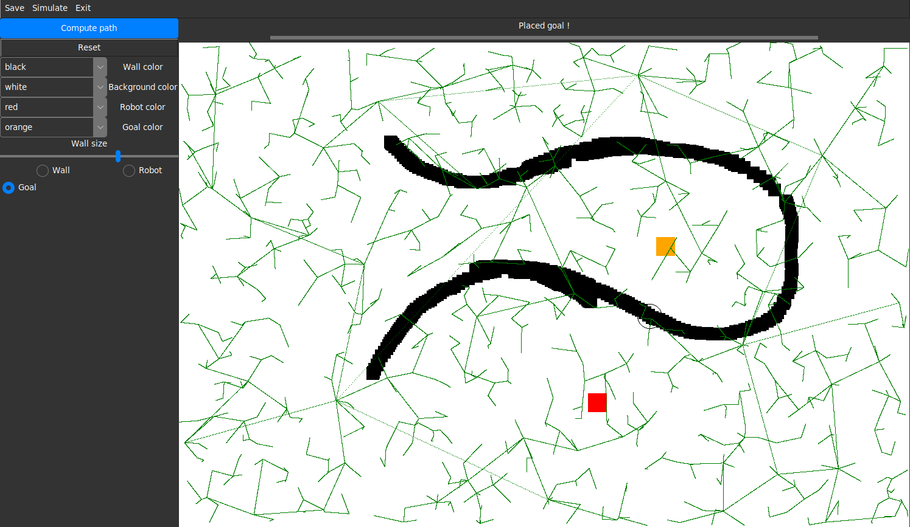

# RRT-Path-Planning-GUI
Small project aiming to develop a simple interface in Python using Tkinter to easily develop and test commonly used path planning algorithms such as RRT

## Current features
- Drawing obstacles (walls) in the canvas
- Adding the robot's initial position and destination
- Generating a random tree to test the display (`generate path` button)
- Saving the current canvas as a PNG image
- Settings for the display (colors)

## State of the project
For now I am mainly focusing on building the interface the user can use to place obstacles, the robot and its destination goal on a map. No logic is yet implemented when it comes to path planning, the interface prototype is no more than a terrible Microsoft Paint ripoff.

I am currently working on implementing tree graphs within the system, so that the interface can display them :

# Credits
Check out the [Azure-ttk-theme repo](https://github.com/rdbende/Azure-ttk-theme) for the Tkinter theme I used for this project.