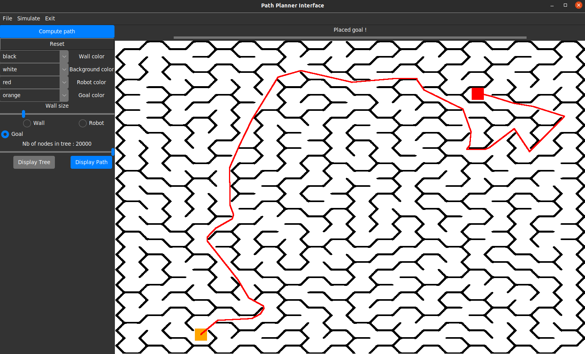
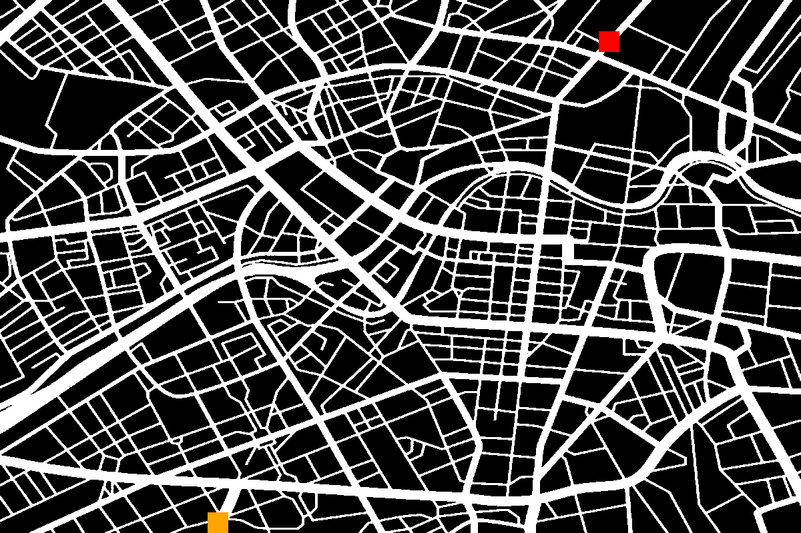
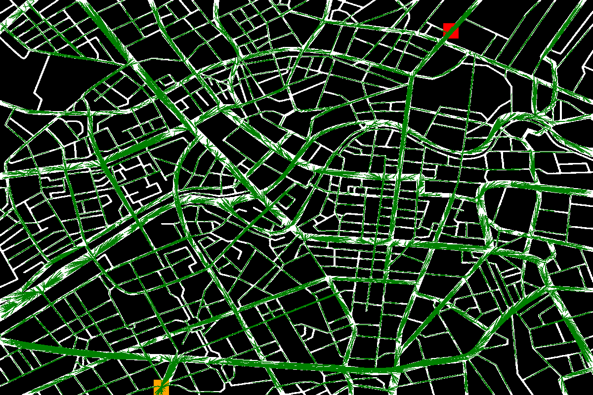
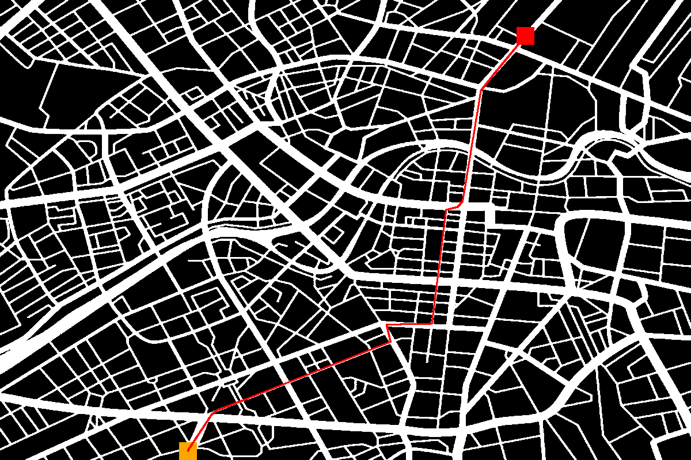

# RRT-Path-Planning-GUI
Small project aiming to develop a simple interface in Python using Tkinter to easily develop and test commonly used path planning algorithms such as RRT

## Table of contents
- [RRT-Path-Planning-GUI](#rrt-path-planning-gui)
  - [Table of contents](#table-of-contents)
  - [Current features](#current-features)
  - [Installation](#installation)
  - [State of the project](#state-of-the-project)
  - [Exemples](#exemples)
- [Credits](#credits)


## Current features
- Drawing obstacles, initial positions and desired positions
- Computing RRT* graph in 2D space
- Computing the shortest path based on this graph
- Saving current view
- Saving current map
- Importing maps

## Installation
You can clone the repository and see for yourself by launching the interface script:

```bash
python3 gui.py
```

## State of the project
The interface can now compute trees and the shortest path (in the 2D space). I am now focusing on running the algorithm in a higher-dimension space to compute "shortest" paths according to specific constraints (not just the spatial distance) taking into account the cinematic models of non-holonomic vehicles.




## Exemples
The following image of an urban map is imported into the program :


The user places an initial position (orange) and a goal position (red). A tree is then computed starting from the initial position :



Using the obtained tree, the program computes the shortest path to the destination :




# Credits
Check out the [Azure-ttk-theme repo](https://github.com/rdbende/Azure-ttk-theme) for the Tkinter theme I used for this project.